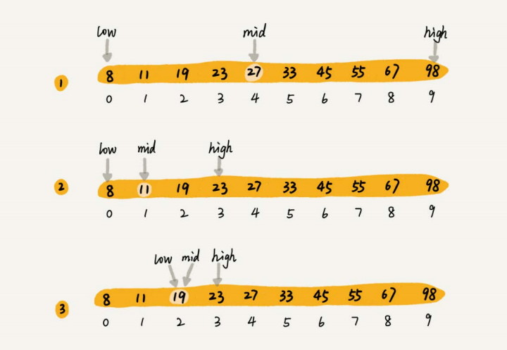
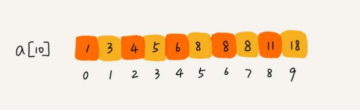

# 二分查找(binary Serach)

* [二分查找(binary Serach)](#二分查找binary-serach)
  * [过程](#过程)
  * [复杂度分析](#复杂度分析)
  * [代码(不存在重复元素)](#代码不存在重复元素)
  * [优化](#优化)
  * [局限性](#局限性)
  * [变形](#变形)
    * [查找第一个值等于给定值的元素](#查找第一个值等于给定值的元素)
    * [查找最后一个值等于给定值的元素](#查找最后一个值等于给定值的元素)
      * [代码](#代码)
    * [查找第一个大于等于给定值的元素](#查找第一个大于等于给定值的元素)
      * [代码](#代码-1)
    * [查找最后一个小于等于给定值的元素](#查找最后一个小于等于给定值的元素)
      * [代码](#代码-2)

## 过程
  
## 复杂度分析
  
等比数列n/2<sup>k</sup>=1，k=log<sub>2</sub><sup>n</sup>，所以复杂度为O(logn)
## 代码(不存在重复元素)
```java
package algorithm;

/**
 * 二分查找
 */
public class BinarySerach {
    public static void main(String[] args) {
        System.out.println(binarySerachRecursive(new int[]{1,2,3,4,5,6,7,8,9},9,10));
    }

    /**
     * 非递归方法
     * @param a
     * @param n
     * @param value
     * @return
     */
    public static int binarySerach(int[] a,int n,int value){
        int low = 0;
        int high = n-1;
        while (low<=high){
            int mid = (low+high)/2;
            if(a[mid]==value){
                return mid;
            }else if(a[mid]>value){
                high = mid-1;
            }else{
                low = mid+1;
            }
        }
        return -1;
    }

    /**
     * 递归方法
     * @param a
     * @param n
     * @param value
     * @return
     */
    public static int binarySerachRecursive(int[] a,int n,int value){
        return binarySerachInternally(a,0,n-1,value);
    }
    public static int binarySerachInternally(int[] a,int low,int high,int value){
        if(low>high){
            return -1;
        }
        int mid = (low+high)/2;
        if(a[mid]==value){
            return mid;
        }else if(a[mid]>value){
            return binarySerachInternally(a,low,mid-1,value);
        }else{
            return binarySerachInternally(a,mid+1,high,value);
        }
    }
}
```
## 优化
* (low+high)/2-->如果两者之和过大可能会发生溢出-->low+(high-low)/2-->位计算更优-->low+(high-low)>>1
## 局限性
* 只能依赖顺序表结构，也就是数组，不支持链表
* 二分查找针对的是有序数据
* 数据量太少不适合二分查找，如果数据量少比如10个数，那遍历和二分查找的速度其实差不多，如果比较操作很耗时，那就还是推荐二分查找
* 数据量太大也不适合二分查找，数组要求连续的内存空间
* 二分查找更适合处理静态数据，没有频繁插入，删除操作
## 变形
### 查找第一个值等于给定值的元素

```java
package algorithm;

/**
 * 二分查找
 */
public class BinarySerach {
    public static void main(String[] args) {
        System.out.println(findFirstByBinarySerach(new int[]{1,2,3,3,3,6,7,8,9},9,3,0,8));
    }
    /**
     * 查找第一个值等于给定值的元素
     * @return
     */
    public static int findFirstByBinarySerach(int[] a ,int n,int value,int low,int high){
        while(low<=high){
            int mid = low+((high-low)>>1);
            if(a[mid]>value){
                high = mid-1;
            }else if(a[mid]<value){
                low = mid+1;
            }else{
                //相等的情况下,mid为0就代表已经是第一个数，a[mid-1]不是value就代表肯定是第一个
                if(mid==0 || a[mid-1]!=value){
                    return mid;
                }
                high = mid-1;
            }
        }
        return -1;
    }
}
```
### 查找最后一个值等于给定值的元素
#### 代码
```java
package algorithm;

/**
 * 二分查找
 */
public class BinarySerach {
    public static void main(String[] args) {
        System.out.println(findEndByBinarySerach(new int[]{1,2,3,3,3,6,7,8,9},9,3,0,8));
    }
    /**
     * 查找最后一个值等于给定值的元素
     * @return
     */
    public static int findEndByBinarySerach(int[] a ,int n,int value,int low,int high){
        while(low<=high){
            int mid = low+((high-low)>>1);
            if(a[mid]>value){
                high = mid-1;
            }else if(a[mid]<value){
                low = mid+1;
            }else{
                //相等的情况下,mid为0就代表已经是第一个数，a[mid+1]不是value就代表肯定是最后一个
                if(mid==0 || a[mid+1]!=value){
                    return mid;
                }
                low = mid+1;
            }
        }
        return -1;
    }
}
```
### 查找第一个大于等于给定值的元素
#### 代码
```java
package algorithm;

/**
 * 二分查找
 */
public class BinarySerach {
    public static void main(String[] args) {
        System.out.println(findFirstgtByBinarySerach(new int[]{1,2,3,3,3,6,7,8,9},3,0,8));
    }
    /**
     * 查找第一个大于等于给定值的元素
     * @return
     */
    public static int findFirstgtByBinarySerach(int[] a ,int value,int low,int high){
        while(low<=high){
            int mid = low+((high-low)>>1);
            if(a[mid]>=value){
                if(mid==0||a[mid-1]<value){
                    return mid;
                }else{
                    high = mid-1;
                }
            }else{
                low = mid+1;
            }
        }
        return -1;
    }
}
```
### 查找最后一个小于等于给定值的元素
#### 代码
```java
package algorithm;

/**
 * 二分查找
 */
public class BinarySerach {
    public static void main(String[] args) {
        System.out.println(findFirstltByBinarySerach(new int[]{1,2,3,3,3,6,7,8,9},3,0,8));
    }

    /**
     * 查找最后一个小于等于给定值的元素
     * @return
     */
    public static int findFirstltByBinarySerach(int[] a ,int value,int low,int high){
        while(low<=high){
            int mid = low+((high-low)>>1);
            if(a[mid]<=value){
                if(mid==0||a[mid+1]>value){
                    return mid;
                }else{
                    low = mid+1;
                }
            }else{
                high = mid-1;
            }
        }
        return -1;
    }
}
```
