# 散列表(Hash Table/Hash 表)

* [散列表(Hash Table/Hash 表)](#散列表hash-tablehash-表)
  * [解释](#解释)
  * [散列函数](#散列函数)
  * [散列冲突](#散列冲突)
    * [开放寻址法](#开放寻址法)
      * [核心思想](#核心思想)
      * [线性探测(Linear Probing)](#线性探测linear-probing)
        * [插入过程](#插入过程)
        * [查找过程](#查找过程)
        * [删除过程](#删除过程)
      * [优点](#优点)
      * [缺点](#缺点)
      * [应用场景](#应用场景)
      * [二次探测(Quadratic probing)](#二次探测quadratic-probing)
      * [双重散列(Double hashing)](#双重散列double-hashing)
      * [装载因子](#装载因子)
        * [装载因子扩容](#装载因子扩容)
        * [插入数据时间复杂度](#插入数据时间复杂度)
        * [避免低效扩容](#避免低效扩容)
          * [分批完成](#分批完成)
        * [总结](#总结)
    * [链表法(常用)](#链表法常用)
      * [插入](#插入)
      * [查找和修改](#查找和修改)
      * [优点](#优点-1)
      * [缺点](#缺点-1)
      * [优化](#优化)
      * [总结](#总结-1)
    * [散列表碰撞攻击](#散列表碰撞攻击)
      * [原理](#原理)
      * [设计散列函数](#设计散列函数)
    * [分析HashMap散列表](#分析hashmap散列表)
      * [初始大小](#初始大小)
      * [装载因子和动态扩容](#装载因子和动态扩容)
      * [散列冲突解决方法](#散列冲突解决方法)
      * [如何涉及散列表](#如何涉及散列表)
  * [LRU缓存淘汰算法](#lru缓存淘汰算法)
    * [例子LinkedHashMap](#例子linkedhashmap)
    
## 解释
* 是数组的一种扩展，由数组演变过来的
## 散列函数
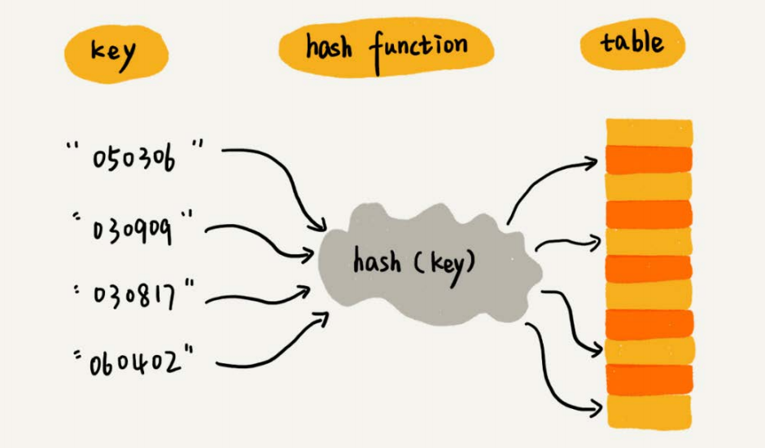  
## 散列冲突
### 开放寻址法
#### 核心思想
如果出现了散列冲突，我们就重新探测一个空闲位置，将其插入
#### 线性探测(Linear Probing)
##### 插入过程
当我们往散列表中插入数据时，如果某个数据经过散列函数散列之后，存储位置已经被占用了，我们就从当前位置开始，依次往后查找，看是否有空闲位置，直到找到为止。
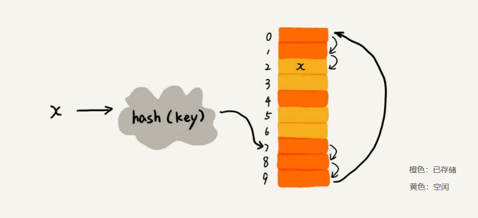  
##### 查找过程
我们通过散列函数求出要查找元素的键值对应的散列值，然后比较数组中下标为散列值的元素和要查找的元素。如果相等，则说明就是我们要找的元素；否则就顺序往后依次查找。如果遍历到数组中的空闲位置，还没有找到，就说明要查找的元素并没有在散列表中。
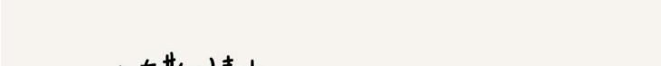  
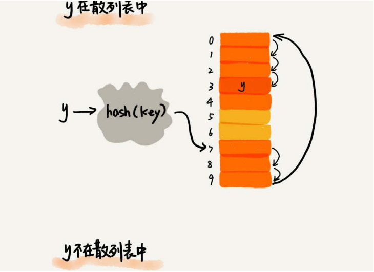  
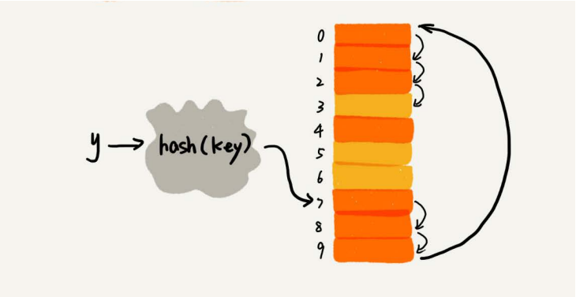  
##### 删除过程
我们不能单纯地把要删除的元素设置为空，可以将删除的元素，特殊标记为deleted。当线性探测查找的时候，遇到标记为deleted的空间，并不是停下来，而是继续往下探测。  
原因：在查找的时候，一旦我们通过线性探测方法，找到一个空闲位置，我们就可以认定散列表中不存在这个数据。但是，如果这个空闲位置是我们后来删除的，就会导致原来的查找算法失效。本来存在的数据，会被认定为不存在。
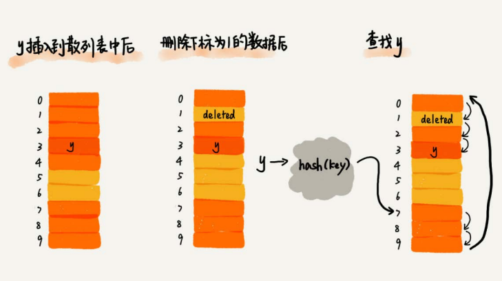  
#### 优点
* 散列表中的数据都存储在数组中，可以有效地利用CPU缓存加快查询速度
* 这种方法实现的散列表，序列化起来比较简单。链表法包含指针，序列化起来就没那么容易。
#### 缺点
* 数据越来越多时，散列冲突发生的可能性就会越来越大，空闲位置会越来越少，线性探测的时间就会越来越久
* 极端情况下，我们可能需要探测整个散列表，所以最坏情况下的时间复杂度为O(n)
* 删除数据的时候比较麻烦，需要特殊标记已经删除掉的数据。导致这种方法比链表法更浪费内存空间
#### 应用场景
当数据量比较小、装载因子小的时候，适合采用开放寻址法(Java中的ThreadLocalMap)。
#### 二次探测(Quadratic probing)
线性探测每次探测的步长是1，那它探测的下标序列就是hash(key)+0，hash(key)+1，hash(key)+2……  
二次探测探测的步长就变成了原来的“二次方”，它探测的下标序列就是hash(key)+0，hash(key)+12，hash(key)+22……
#### 双重散列(Double hashing)
不仅要使用一个散列函数。我们使用一组散列函数hash1(key)，hash2(key)，hash3(key)……我们先用第一个散列函数，如果计算得到的存储位置已经被占用，再用第二个散列函数，依次类推，直到找到空闲的存储位置。
#### 装载因子
装载因子(load factor)：表示空位的多少  
散列表的装载因子=填入表中的元素个数/散列表的长度  
装载因子越大，说明空闲位置越少，冲突越多，散列表的性能会下降。
##### 装载因子扩容
当装载因子过大时，我们也可以进行动态扩容，重新申请一个更大的散列表，将数据搬移到这个新散列表中。  
针对散列表的扩容，数据搬移操作要复杂很多。因为散列表的大小变了，数据的存储位置也变了，所以我们需要通过散列函数重新计算每个数据的存储位置。  
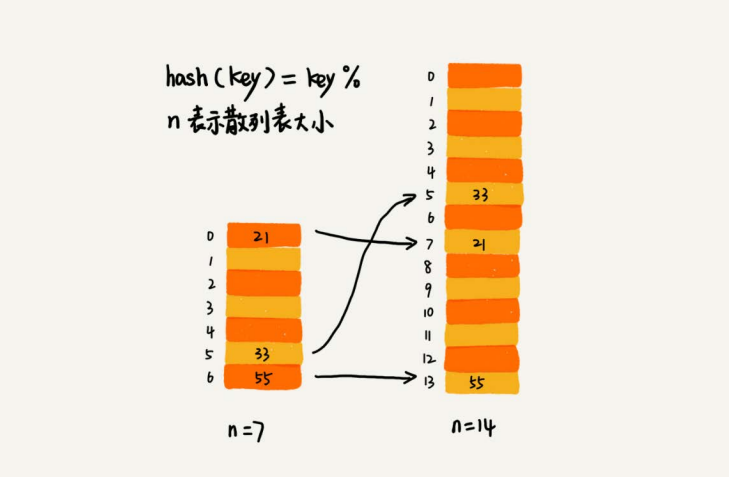    
##### 插入数据时间复杂度
插入不需要扩容，时间复杂度为O(1)  
插入需要扩容，时间复杂度为O(n)，最好时间复杂度O(1)
##### 避免低效扩容
###### 分批完成
避免一次迁移过慢，可以将扩容操作穿插在插入操作的过程中，分批完成  
缺点：查询时需兼容老列表，如果新散列表没查询到，需要查询老散列表  
这种均摊情况下，就避免了一次性扩容耗时过多的情况。任何情况下，插入一个数据的时间复杂度都是O(1)。
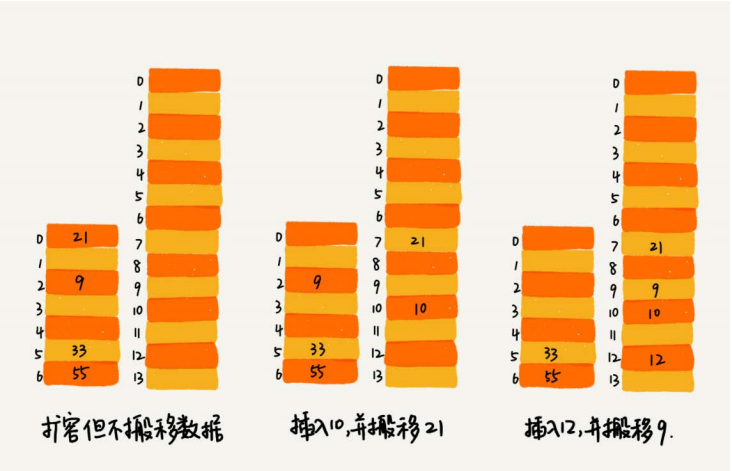    
##### 总结
装载因子阈值需要选择得当。如果太大，会导致冲突过多；如果太小，会导致内存浪费严重。
### 链表法(常用)
在散列表中，每个"桶(bucket)"或者"槽(slot)"会对应一条链表，所有散列值相同的元素我们都放到相同槽位对应的链表中。
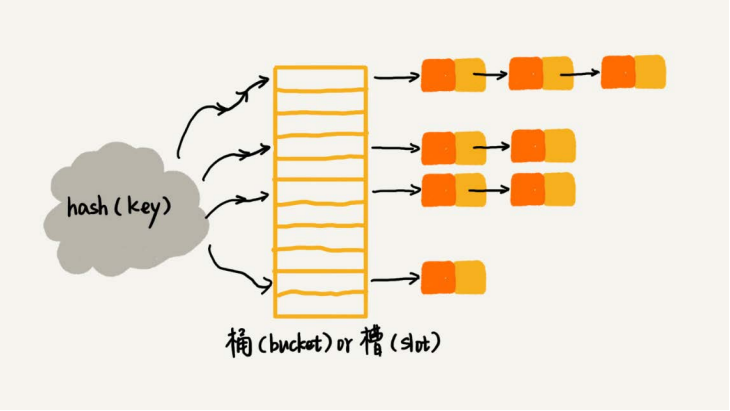  
#### 插入
插入同链表，时间复杂度是O(1)
#### 查找和修改
需要遍历
#### 优点
* 不需要像开放寻址法那样事先申请好空间
* 对大装载因子的容忍度更高
#### 缺点
* 链表需要存储指针，空间不是连续的
#### 优化
我们将链表法中的链表改造为其他高效的动态数据结构，比如跳表、红黑树。那最终退化成的散列表的查找时间也只不过是O(logn)。
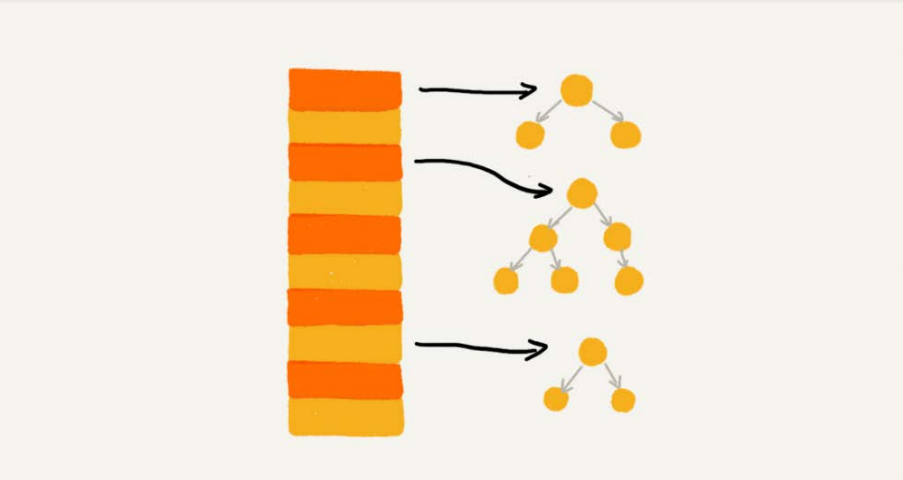  
#### 总结
链表的散列冲突处理方法比较适合存储大对象、大数据量的散列表，而且，比起开放寻址法，它更加灵活，支持更多的优化策略，比如用红黑树代替链表。
### 散列表碰撞攻击
#### 原理
在极端情况下，有些恶意的攻击者，还有可能通过精心构造的数据，使得所有的数据经过散列函数之后，都散列到同一个槽里。如果我们使用的是基于链表的冲突解决方法，那这个时候，散列表就会退化为链表，查询的时间复杂度就从O(1)急剧退化为O(n)。  
如果散列表中有10万个数据，退化后的散列表查询的效率就下降了10万倍。更直接点说，如果之前运行100次查询只需要0.1秒，那现在就需要1万秒。这样就有可能因为查询操作消耗大量CPU或者线程资源，导致系统无法响应其他请求，从而达到拒绝服务攻击(DoS)的目的。
#### 设计散列函数
* 不能过于复杂，复杂会消耗很多计算时间，也就间接的影响到散列表的性能。
* 尽可能随机并且均匀分布，这样才能避免或者最小化散列冲突，而且即便出现冲突，散列到每个槽里的数据也会比较平均，不会出现某个槽内数据特别多的情况
### 分析HashMap散列表
#### 初始大小
HashMap默认的初始大小是16，当然这个默认值是可以设置的，如果事先知道大概的数据量有多大，可以通过修改默认初始大小，减少动态扩容的次数，这样会大大提高HashMap的性能。
#### 装载因子和动态扩容
最大装载因子默认是0.75，当HashMap中元素个数超过0.75*capacity（capacity表示散列表的容量）的时候，就会启动扩容，每次扩容都会扩容为原来的两倍大小。
#### 散列冲突解决方法
HashMap底层采用链表法来解决冲突。即使负载因子和散列函数设计得再合理，也免不了会出现拉链过长的情况，一旦出现拉链过长，则会严重影响HashMap的性能。
于是，在JDK1.8版本中，为了对HashMap做进一步优化，我们引入了红黑树。而当链表长度太长（默认超过8）时，链表就转换为红黑树。我们可以利用红黑树快速增删改查的特点，提高HashMap的性能。当红黑树结点个数少于8个的时候，又会将红黑树转化为链表。因为在数据量较小的情况下，红黑树要维护平衡，比起链表来，性能上的优势并不明显。
#### 如何涉及散列表
* 支持快速的查询、插入、删除操作；
* 内存占用合理，不能浪费过多的内存空间；
* 性能稳定，极端情况下，散列表的性能也不会退化到无法接受的情况
* 设计一个合适的散列函数；
* 定义装载因子阈值，并且设计动态扩容策略；
* 选择合适的散列冲突解决方法。
## LRU缓存淘汰算法
  
### 例子LinkedHashMap
HashMap<Integer, Integer> m = new LinkedHashMap<>(10, 0.75f, true);  
m.put(3, 11);  
m.put(1, 12);  
m.put(5, 23);  
m.put(2, 22);  
m.put(3, 26);  
m.get(5);  
for (Map.Entry e : m.entrySet()) {  
 System.out.println(e.getKey());  
}  
  
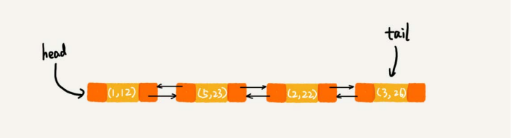  
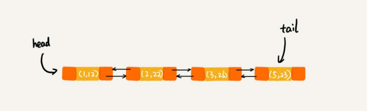  
