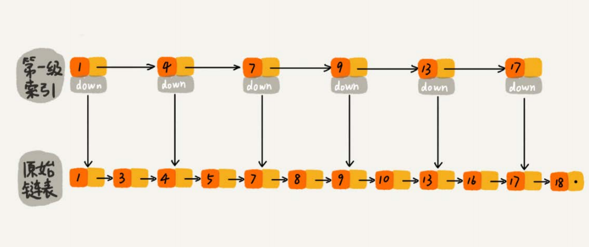
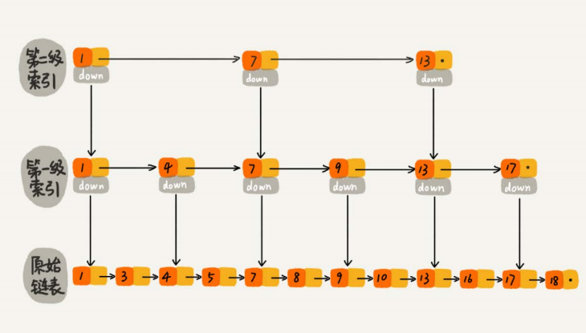
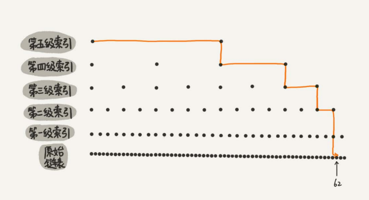
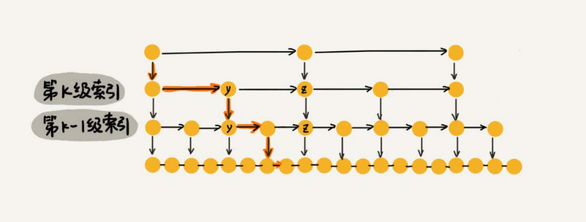
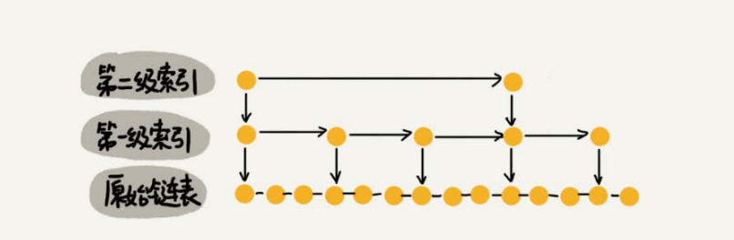
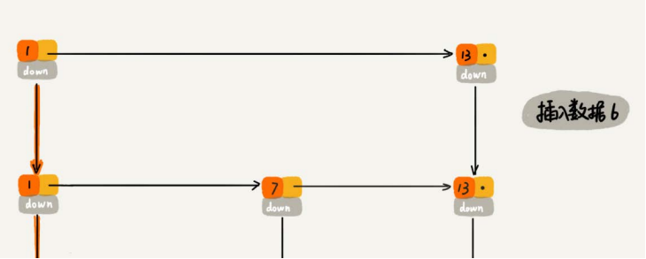
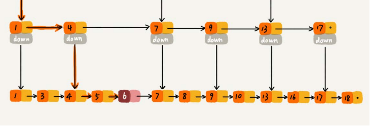
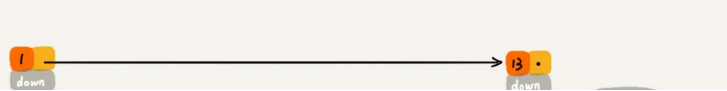
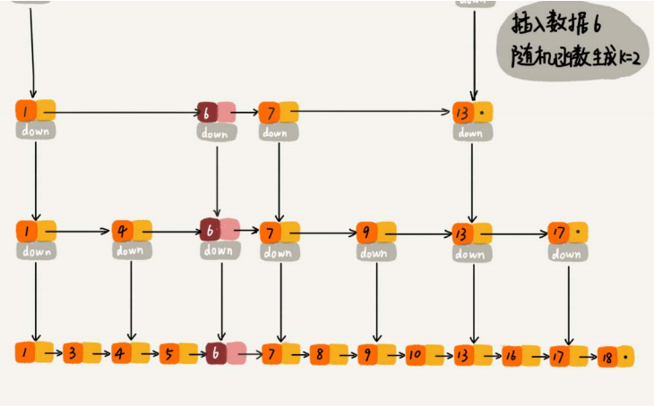

# 跳表(skip list)

* [跳表(skip list)](#跳表skip-list)
  * [解释](#解释)
  * [时间复杂度分析](#时间复杂度分析)
  * [空间复杂度](#空间复杂度)
  * [高效的动态插入和删除](#高效的动态插入和删除)
    * [插入和删除的时间复杂度都是O(logn)](#插入和删除的时间复杂度都是ologn)
    * [删除的时候还需删除索引节点上的节点](#删除的时候还需删除索引节点上的节点)
  * [索引动态更新](#索引动态更新)
  * [扩展](#扩展)
    * [为什么会选择跳表而不是红黑树](#为什么会选择跳表而不是红黑树)

## 解释
为链表建立一级索引
  
  
  
## 时间复杂度分析
  
第一级索引n/2  
第二级索引n/4  
第三级索引n/8  
...  
第k级索引n/2k  
假设第k级索引有两个节点  
n/2k = 2  
k = log2n-1
每层最多扫描3个节点，时间复杂度为O(logn)
## 空间复杂度
一共额外建立n/2+n/4+n/8+...+8+4+2 = n-2-->O(n)  
如果需要减少空间，可将每三个节点抽一个索引-->n/3+n/9+n/27+...+9+3+1 = n-2-->O(n)
如果本身数量就很大，其实就可以忽略掉索引空间  
  
## 高效的动态插入和删除

    
### 插入和删除的时间复杂度都是O(logn)
### 删除的时候还需删除索引节点上的节点
## 索引动态更新

   
## 扩展
Redis中的有序集合（Sorted Set）就是用跳表来实现的
### 为什么会选择跳表而不是红黑树
* 插入、删除、查找以及迭代输出有序序列这几个操作，红黑树也可以完成，时间复杂度跟跳表是一样的。但是，按照区间来查找数据这个操作，红黑树的  效率没有跳表高。
* 跳表更容易代码实现（相对红黑树更简单）
* 跳表更加灵活，它可以通过改变索引构建策略，有效平衡执行效率和内存消耗
