# 排序

* [非线性排序](#非线性排序)
  * [排序算法分析](#排序算法分析)
    * [如何分析排序算法](#如何分析排序算法)
    * [排序算法稳定性](#排序算法稳定性)
  * [冒泡排序(Bubble Sort)](#冒泡排序bubble-sort)
    * [过程](#过程)
    * [代码](#代码)
    * [分析平均复杂度](#分析平均复杂度)
      * [有序度](#有序度)
        * [概念](#概念)
        * [公式](#公式)
        * [分析](#分析)
    * [总结](#总结)
  * [插入排序(Insertion Sort)](#插入排序insertion-sort)
    * [过程](#过程-1)
    * [代码](#代码-1)
    * [总结](#总结-1)
  * [选择排序(Selection Sort)](#选择排序selection-sort)
    * [原理](#原理)
    * [过程](#过程-2)
    * [代码](#代码-2)
    * [总结](#总结-2)
  * [归并排序(Merge Sort)](#归并排序merge-sort)
    * [过程](#过程-3)
    * [代码](#代码-3)
    * [复杂度分析](#复杂度分析)
    * [总结](#总结-3)
  * [快速排序(Quick Sort)](#快速排序quick-sort)
    * [过程](#过程-4)
    * [代码](#代码-4)
    * [快速排序归并排序的区别](#快速排序归并排序的区别)
    * [总结](#总结-4)
* [线性排序](#线性排序)
  * [桶排序，计数排序，基数排序复杂度都为O(n)](#桶排序，计数排序，基数排序复杂度都为on)
  * [桶排序(Bucket Sort)](#桶排序bucket-sort)
    * [核心思想](#核心思想)
    * [桶排序时间复杂度分析](#桶排序时间复杂度分析)
  * [计数排序(Counting Sort)](#计数排序counting-sort)
    * [核心思想](#核心思想-1)
    * [缺点](#缺点)
  * [基数排序(Radix Sort)](#基数排序radix-sort)
    * [核心思想](#核心思想-2)
    * [应用领域](#应用领域)
* [排序优化](#排序优化)
    * [优化快速排序](#优化快速排序)
      * [分区算法](#分区算法)


# 非线性排序
## 排序算法分析
| 排序算法 | 时间复杂度 | 是否基于比较 |
| ---- | ---- | ---- |
| 冒泡、插入、选择 |O(n^2)|是|
|快排、归并|O(nlogn)|是|
|桶、计数、基数|O(n)|否|

| 排序算法 | 是原地排序 | 是否稳定 | 最好 | 最坏 | 平均 | 
| ---- | ---- | ---- | ---- | ---- | ---- |
| 冒泡排序 |是|是|O(n)|O(n^2)|O(n^2)|
| 插入排序 |是|是|O(n)|O(n^2)|O(n^2)|
| 选择排序 |是|否|O(n^2)|O(n^2)|O(n^2)|
### 如何分析排序算法
* 最好情况、最坏情况、平均情况时间复杂度
* 时间复杂度的系数、常数 、低阶
* 比较次数和交换(或移动)次数
### 排序算法稳定性
比如我们有一组数据2，9，3，4，8，3，按照大小排序之后就是2，3，3，4，8，9，如果前后两个3顺序不变，那就是稳定排序算法，如果顺序变了就是不稳定排序算法
## 冒泡排序(Bubble Sort)
### 过程  
  
  
### 代码
```java
import java.util.Arrays;

/**
 * 冒泡排序
 */
public class BubbleSort {
    public static void main(String[] args) {
        System.out.println(Arrays.toString(bubbleSort(new int[]{6,5,4,3,2,1})));
    }
    public static int[] bubbleSort(int[] array){
        boolean flag = false;
        for(int i=0;i<array.length;i++){
            for(int j=0;j<array.length-i-1;j++){
                if(array[j]>array[j+1]){
                    int t = array[j];
                    array[j] = array[j+1];
                    array[j+1] = t;
                    flag = true;
                }
            }
            if(!flag){
                break;
            }
        }
        return array;
    }
}
```
###  分析平均复杂度
#### 有序度
##### 概念
有序度是数组中具有有序关系的元素对的个数，比如2，4，3，1，5，6，有序度为11，因为有序元素有11个，(2,4),(2,3),(2,5),(2,6),(4,5),(4,6),(3,5),(3,6),(1,5),(1,6),(5,6)。
##### 公式
* 满有序度=n*(n-1)/2
* 逆序度=满有序度-有序度
##### 分析
* 每交换一次有序度加1，所以如果是最坏情况下要交换n*(n-1)/2次
* 取中间值n*(n-1)/4
* 比较操作要比交换操作多，复杂度的上限是O(n^2)  
**结论：平均情况下的时间复杂度就是O(n^2)**
### 总结
* 插入排序是原地排序算法
* 插入排序是稳定的排序算法
* 插入排序最好是时间复杂度为O(n)，最坏情况时间复杂度为O(n^2)，平均复杂度是O(n^2)
## 插入排序(Insertion Sort)
### 过程
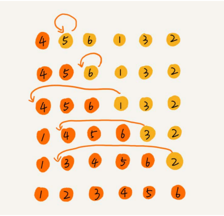  
### 代码
```java
import java.util.Arrays;

/**
 * 插入排序
 */
public class InsertionSort {
    public static void main(String[] args) {
        System.out.println(Arrays.toString(insertionSort(new int[]{6,5,4,3,2,1})));
    }
    public static int[] insertionSort(int[] array){
        for(int i=1;i<array.length;i++){
            int j =i-1;
            int t = array[i];//要插入的数据
            for(;j>=0;j--){
                if(t<array[j]){
                    array[j+1] = array[j];
                }else{
                    break;
                }
            }
            array[j+1] = t;//插入数据
        }
        return array;
    }
}
```
### 总结
* 插入排序为原地排序算法
* 插入排序为稳定排序算法
* 最坏时间复杂度为O(n^2),最好时间复杂度为O(n),平均复杂度为O(n^2)
## 选择排序(Selection Sort)
### 原理
选择最小的数放到已排序区间的尾端
### 过程
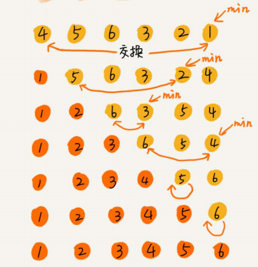  
### 代码
```java
import java.util.Arrays;

public class SelectionSort {
    public static void main(String[] args) {
        System.out.println(Arrays.toString(selectionSort(new int[]{4,5,6,3,2,1})));
    }

    public static int[] selectionSort(int[] array) {
        for (int i = 0; i < array.length; i++) {
            int j=i+1;
            int min = i;
            for(;j<array.length;j++){
                if(array[j]<array[min]){
                    min = j;
                }
            }
            int t = array[i];
            array[i] = array[min];
            array[min] = t;
            System.out.println(Arrays.toString(array));
        }
        return array;
    }
}
```
### 总结
* 选择排序是原地排序算法
* 选择排序不是稳定排序算法
* 选择排序最好，最坏，平均复杂度都是O(n^2)

## 归并排序(Merge Sort)
### 过程
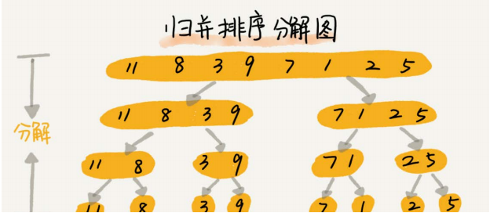
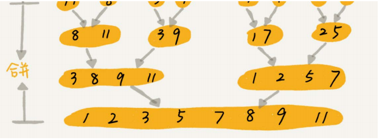   
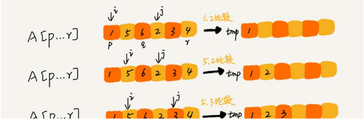  
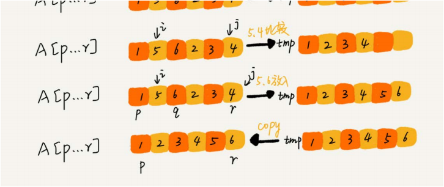  
### 代码
```java
import java.util.Arrays;

public class MergeSort {
    public static void main(String[] args) {
        int[] array = new int[]{11,8,3,9,7,1,2,5};
        mergeSort(array);
        System.out.println(Arrays.toString(array));
    }
    public static void mergeSort(int[] array){
        merge_sort_c(array,0,array.length-1);
    }

    private static void merge_sort_c(int[] array, int p, int r) {
        //终止条件
        if(p>=r){
            return;
        }
        //取中间位置
        int q = (p+r)/2;
        merge_sort_c(array,p,q);
        merge_sort_c(array,q+1,r);
        //合并
        merge(p,q,r,array);
    }

    /**
     * 合并
     * @param p 起始位置
     * @param q 中间位置
     * @param r 末尾位置
     * @param array
     */
    private static void merge(int p, int q, int r, int[] array) {
        int i = p;
        int j = q+1;
        int k = 0;
        int[] temp = new int[array.length];
        //比较大小
        while(i<=q&&j<=r){
            if(array[i]<=array[j]){
                temp[k++] = array[i++];
            }else{
                temp[k++] = array[j++];
            }
        }
        //判读哪个有剩余数据，放到temp中
        while(i<=q){
            temp[k++] = array[i];
            i++;
        }
        while(j<=r){
            temp[k++] = array[j];
            j++;
        }
        //copy数据到array
        for(int m=0;m<=r-p;m++){
            array[p+m] = temp[m];
        }
    }
}
```
### 复杂度分析
假设n个元素归并排序时间为T(n) ---> 分解成两个子数组排序时间为T(n/2) ---> merged的时间复杂度是O(n)  
T(1) = C;n=1时，只需要常量级的执行时间，表示为C  
T(n) = 2T(n/2)+n;n>1  
&emsp;&emsp;= 2*(2*T(n/4)+n/2)+n=4*T(n/4)+2*n  
&emsp;&emsp;= 4*(2*T(n/8)+n/4)+2*n=8*T(n/8)+3*n  
&emsp;&emsp;.......  
&emsp;&emsp;=2^k*T(n/2^k)+k*n
当T(n/2^k)=T(1)--->n/2^k=1--->k=log2n--->O(nlogn)
### 总结
* 归并排序是稳定的排序算法
* 归并排序复杂度为O(nlogn)
* 归并排序不是原地排序算法,主要是因为合并函数无法原地执行(没有快排厉害的原因，快排解决它占用空间太多问题)

## 快速排序(Quick Sort)
### 过程
  
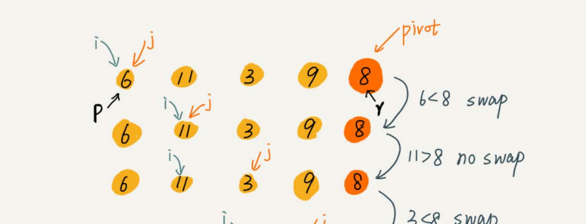  
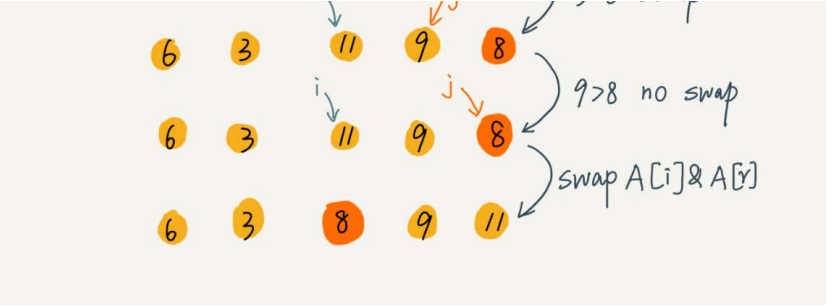  
### 代码
```java
import java.util.Arrays;

public class QuickSort {
    public static void main(String[] args) {
        int[] array = new int[]{5,9,2,3,6,8};
        quickSort(array);
        System.out.println(Arrays.toString(array));
    }
    public static void quickSort(int[] array){
        quick_sort_c(array,0,array.length-1);
    }

    private static void quick_sort_c(int[] array, int p, int r) {
        if(p>=r){
            return;
        }
        int q = partition(array,p,r);
        quick_sort_c(array,p,q-1);
        quick_sort_c(array,q+1,r);
    }

    private static int partition(int[] array, int p, int r) {
        int pivot = array[r];
        int i = p;
        for(int j=p;j<r;j++){
            if(array[j]<pivot){
                int t = array[j];
                array[j] = array[i];
                array[i] = t;
                i = i+1;
            }
        }
        int t = array[i];
        array[i] = array[r];
        array[r] = t;
        return i;
    }

}
```
### 快速排序归并排序的区别
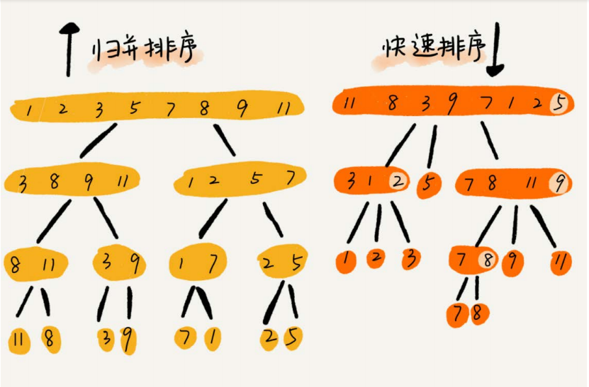  
### 总结
* 快速排序不是稳定排序
* 快速排序是原地排序
* 快速排序最好时间复杂度为O(nlogn)，最坏时间复杂度(这个排序是已经排好序)为O(n^2),平均时间复杂度为O(nlogn)

# 线性排序
## 桶排序，计数排序，基数排序复杂度都为O(n)
## 桶排序(Bucket Sort)
### 核心思想
将要排序的数据分到几个有序的桶里，每个桶里的数据再单独进行排序
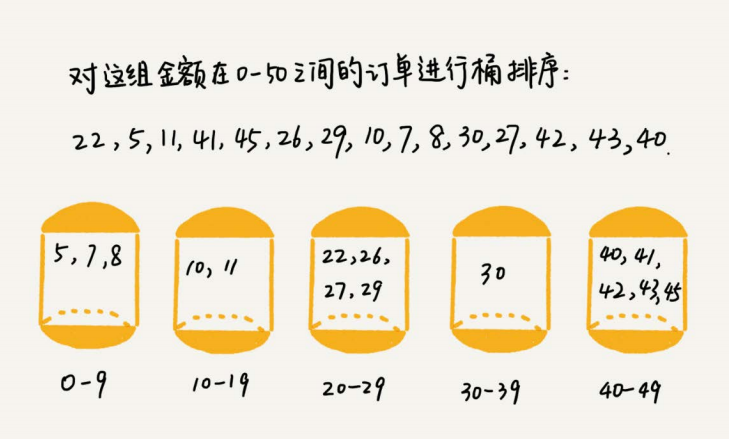 
### 桶排序时间复杂度分析
如果要排序的数据有n个，我们把它们均匀地划分到m个桶内，每个桶里就有k=n/m个元素。每个桶内部使用快速排序，时间复杂度为O(k * logk)。m个桶排序的时间复杂度就是O(m * k * logk)，因为k=n/m，所以整个桶排序的时间复杂度就是O(n*log(n/m))。当桶的个数m接近数据个数n时，log(n/m)就是一个非常小的常量，这个时候桶排序的时间复杂度接近O(n)。
## 计数排序(Counting Sort)
### 核心思想
当要排序的n个数据，所处的范围并不大的时候，比如最大值是k，我们就可以把数据划分成k个桶。每个桶内的数据值都是相同的，省掉了桶内排序的时间<br/>
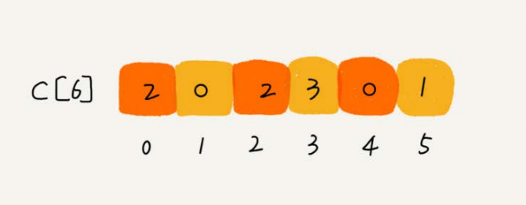
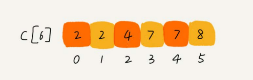 
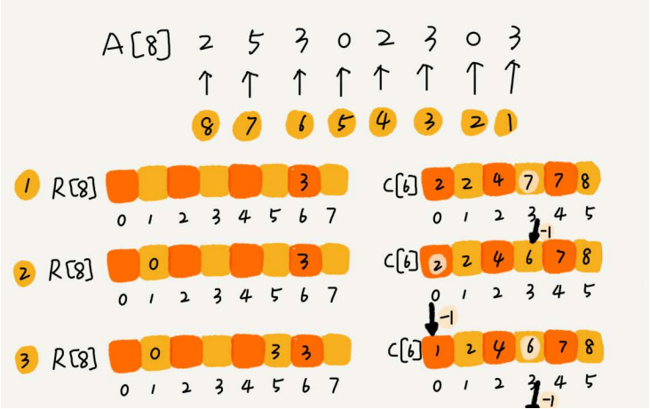  
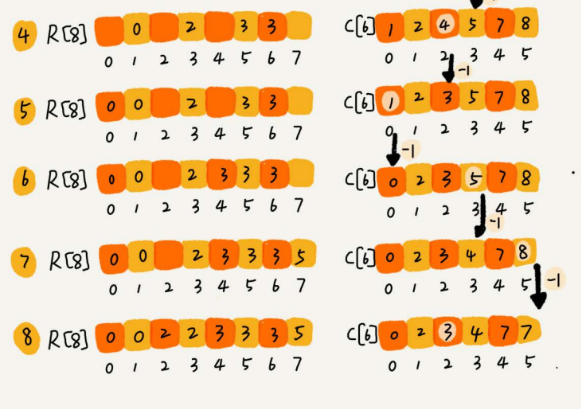 
```java
package algorithm;

import java.util.Arrays;

public class CountionSort {
    public static void main(String[] args) {
        int[] array = new int[]{3,4,2,1,4,5,6,5,0};
        countionSor(array,9);
        System.out.println(Arrays.toString(array));
    }
    public static void countionSor(int[] array,int n){
        //查找最大值,看需要建立多长的数组
        int max = array[0];
        for(int i=1;i<array.length;i++){
            if(max<array[i]){
                max = array[i];
            }
        }
        //建立数组c，计算array中出现每个值的次数，并放到该值对应的c数组下标中
        int[] c = new int[max+1];
        for(int i=0;i<n;i++){
            c[array[i]]++;
        }
        //计算后面一个值=当前值+前面那个值
        for(int i=1;i<c.length;i++){
            c[i] = c[i]+c[i-1];
        }
        //存储排序后的数组
        int[] r = new int[n];
        for(int i=n-1;i>=0;--i){
            //计算array[i]应该存储在r哪个位置，c中记录了当前这个数据前面有多少数据(这个是包含本身的)所以需要减一
            int index = c[array[i]]-1;
            r[index] = array[i];
            c[array[i]]--;
        }
        for(int i=0;i<n;i++){
            array[i] = r[i];
        }
    }
}
```
### 缺点
* 使用很局限
* 如果数据范围比要排序的数据大很多，就不适合用计数排序了
* 计数排序只能给非负整数排序(数组下标没有负数)，这种情况只能做一定转换，比如[-100,100]可以先将范围加100，让其在正数范围内
## 基数排序(Radix Sort)
### 核心思想
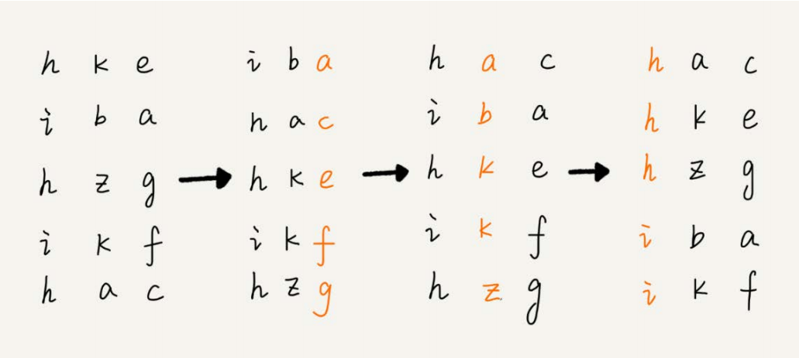  
注意：这里每位排序的排序算法必须是稳定算法
### 应用领域
* 数据较大，比如手机号的排序，一位一位做对比的数据
# 排序优化
| 排序算法 | 时间复杂度 | 是否稳定 | 是原地排序| 
| ---- | ---- | ---- | ---- |
| 冒泡排序 |O(n)|是|是|
| 插入排序 |O(n)|是|是|
| 选择排序 |O(n^2)|否|是|
|快速排序 |O(nlogn)|否|是|
|归并排序 |O(nlogn)|是|否|
|计数排序|O(n+k)k是数据范围|是|否|
|桶排序|O(n)|是|否|
|基数排序|O(dn)d是维度|是|否|
### 优化快速排序
#### 分区算法
* 三数取中法
* 随机法
