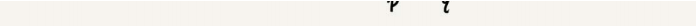

# 树

* [树](#树)
  * [二叉树(Binary Tree)](#二叉树binary-tree)
    * [链式存储法](#链式存储法)
    * [二叉树的遍历](#二叉树的遍历)
    * [二叉查找树(Binary Search Tree)](#二叉查找树binary-search-tree)
      * [二叉查找树的查找操作](#二叉查找树的查找操作)
      * [二叉查找树的插入操作](#二叉查找树的插入操作)
      * [二叉查找树的删除操作](#二叉查找树的删除操作)
      * [支持重复数据的二叉查找树](#支持重复数据的二叉查找树)
        * [第一种方法](#第一种方法)
        * [第二种方法](#第二种方法)
          * [插入](#插入)
          * [查找](#查找)
          * [删除](#删除)
      * [散列表和二叉查找树比较](#散列表和二叉查找树比较)
    * [平衡二叉查找树](#平衡二叉查找树)
      * [红黑树(Red-Black Tree)](#红黑树red-black-tree)
        * [分析红黑树的高度](#分析红黑树的高度)
        * [各种平衡二叉查找树比较](#各种平衡二叉查找树比较)
        * [特性](#特性)
        * [红黑树基本思想](#红黑树基本思想)
          * [左旋右旋](#左旋右旋)
          * [插入操作的平衡调整](#插入操作的平衡调整)
          * [删除操作的平衡调整](#删除操作的平衡调整)
    * [递归树](#递归树)
      * [递归树与时间复杂度分析](#递归树与时间复杂度分析)
      * [归并排序时间复杂度分析](#归并排序时间复杂度分析)
      * [快速排序时间复杂度分析](#快速排序时间复杂度分析)
      * [分析斐波那契数列的时间复杂度](#分析斐波那契数列的时间复杂度)
      * [分析全排列的时间复杂度](#分析全排列的时间复杂度)


  
  
  
## 二叉树(Binary Tree)
  
### 链式存储法
  
满二叉树可以有效利用空间位置，但是完全二叉树不行
  
  
### 二叉树的遍历
* 前序遍历是指，对于树中的任意节点来说，先打印这个节点，然后再打印它的左子树，最后打印它的右子树。
* 中序遍历是指，对于树中的任意节点来说，先打印它的左子树，然后再打印它本身，最后打印它的右子树。
* 后序遍历是指，对于树中的任意节点来说，先打印它的左子树，然后再打印它的右子树，最后打印这个节点本身。  
  
```java
package algorithm;

import common.TreeNode;

/**
 * 二叉树
 */
public class BinaryTree {
    /**
     * 前序遍历
     */
    public static void preorderTraversal(TreeNode treeNode){
        if(treeNode!=null){
            System.out.println(treeNode.val);
            preorderTraversal(treeNode.left);
            preorderTraversal(treeNode.right);
        }
    }
    /**
     * 中序遍历:可以输出有序的数据序列
     */
    public static void inOrderTraversal(TreeNode treeNode){
        if(treeNode!=null){
            inOrderTraversal(treeNode.left);
            System.out.println(treeNode.val);
            inOrderTraversal(treeNode.right);
        }
    }
    /**
     * 后续遍历
     */
    public static void postOrderTraversal(TreeNode treeNode){
        if(treeNode!=null){
            postOrderTraversal(treeNode.left);
            postOrderTraversal(treeNode.right);
            System.out.println(treeNode.val);
        }
    }
}

```
### 二叉查找树(Binary Search Tree)
左子树中的每个节点的值，都要小于这个节点的值，而右子树节点的值都大于这个节点的值。
  
#### 二叉查找树的查找操作
 
```java
package algorithm;

import common.TreeNode;

/**
 * 二叉树
 */
public class BinaryTree {
    /**
     * 二叉查找树的查找操作
     */
    public static TreeNode binarySearchTreeFind(TreeNode treeNode,int data){
        if(treeNode==null){
            return null;
        }
        if(treeNode.val==data){
            return treeNode;
        }else if(treeNode.val>data){
            return binarySearchTreeFind(treeNode.left,data);
        }else{
            return binarySearchTreeFind(treeNode.right,data);
        }
    }

}
``` 
#### 二叉查找树的插入操作
 
```java
package algorithm;

import common.TreeNode;

/**
 * 二叉树
 */
public class BinaryTree {
    /**
     * 二叉查找树的插入操作
     */
    public static TreeNode binarySearchTreeInsert(TreeNode treeNode,int data){
        if(treeNode==null){
            return new TreeNode(data);
        }
        TreeNode p = treeNode;
        while(p!=null){
            if(data>p.val){
                if(p.right==null){
                    p.right = new TreeNode(data);
                    return treeNode;
                }
                p = p.right;
            }else{
                if(p.left==null){
                    p.left = new TreeNode(data);
                    return treeNode;
                }
                p = p.left;
            }
        }
        return null;
    }
}

```
#### 二叉查找树的删除操作
 
```java
package algorithm;

import common.TreeNode;

/**
 * 二叉树
 */
public class BinaryTree {
    /**
     * 二叉查找树的删除操作
     */
    public static void binarySearchTreeDelete(TreeNode treeNode,int data){
        TreeNode parent = null;//要删除数据的父节点
        TreeNode cur = treeNode;//当前删除节点
        //查找要删除的节点，定位他的父节点
        while(cur!=null && cur.val!=data){
            parent = cur;
            if(data > cur.val){
                cur = cur.right;
            } else {
                cur = cur.left;
            }
        }
        //两个节点都不为空的情况下，要找到他右节点子节点最小的数据（还要删除）替换他的位置
        if(cur.left!=null && cur.right!=null){
            TreeNode rightMin = cur.right;//右节点最小的位置
            TreeNode rightMinParent = cur;//他的父节点
            while(rightMin.left!=null){
                rightMinParent = rightMin;
                rightMin = rightMin.left;
            }
            cur.val = rightMin.val;
            cur = rightMin;
            parent = rightMinParent;
        }
        // 删除节点是叶子节点或者仅有一个节点
        TreeNode childs = null;
        if(cur.left!=null){
            childs = cur.left;
        }else if(cur.right!=null){
            childs = cur.right;
        }else{
            childs = null;
        }
        //删除
        if(parent==null){
            treeNode = childs;//删除的是根节点
        }else if(parent.left == cur){
            parent.left = childs;
        }else{
            parent.right = childs;
        }
    }
}
```
#### 支持重复数据的二叉查找树
##### 第一种方法
比较容易。二叉查找树中每一个节点不仅会存储一个数据，因此我们通过链表和支持动态扩容的数组等数据结构，把值相同的数据都存储在同一个节点上。

##### 第二种方法
每个节点仍然只存储一个数据。在查找插入位置的过程中，如果碰到一个节点的值，与要插入数据的值相同，我们就将这个要插入的数据放到这个节点的右子树，也就是说，把这个新插入的数据当作大于这个节点的值来处理。
###### 插入
 
###### 查找
 
###### 删除
 
#### 散列表和二叉查找树比较
* 散列表中的数据是无序存储的，如果要输出有序的数据，需要先进行排序。而对于二叉查找树来说，我们只需要中序遍历，就可以在O(n)的时间复杂度内，输出有序的数据序列。
* 散列表扩容耗时很多，而且当遇到散列冲突时，性能不稳定，尽管二叉查找树的性能不稳定，但是在工程中，我们最常用的平衡二叉查找树的性能非常稳定，时间复杂度稳定在O(logn)
* 尽管散列表的查找等操作的时间复杂度是常量级的，但因为哈希冲突的存在，这个常量不一定比logn小，所以实际的查找速度可能不一定比O(logn)快。加上哈希函数的耗时，也不一定就比平衡二叉查找树的效率高。
* 散列表的构造比二叉查找树要复杂，需要考虑的东西很多。比如散列函数的设计、冲突解决办法、扩容、缩容等。平衡二叉查找树只需要考虑平衡性这一个问题，而且这个问题的解决方案比较成熟、固定。
### 平衡二叉查找树
二叉树中任意一个节点的左右子树的高度相差不能大于1。完全二叉树、满二叉树其实都是平衡二叉树
 
#### 红黑树(Red-Black Tree)
  
它是一种不严格的平衡二叉查找树  
红黑树中的节点，一类被标记为黑色，一类被标记为红色。除此之外，一棵红黑树还需要满足这样几个要求：
* 根节点是黑色的
* 每个叶子节点都是黑色的空节点（NIL），也就是说，叶子节点不存储数据
* 任何相邻的节点都不能同时为红色，也就是说，红色节点是被黑色节点隔开的
* 每个节点，从该节点到达其可达叶子节点的所有路径，都包含相同数目的黑色节点  
##### 分析红黑树的高度
二叉查找树很多操作的性能都跟树的高度成正比。一棵极其平衡的二叉树（满二叉树或完全二叉树）的高度大约是log2n，所以如果要证明红黑树是近似平衡的，我们只需要分析，红黑树的高度是否比较稳定地趋近log2n就好了
  
* 将四叉树部分节点放到叶子节点上， 会变成完全二叉树，完全二叉树的高度为log2n，红色节点数目不会超过log2n，所以高度最多为2log2n
##### 各种平衡二叉查找树比较
AVL树是一种高度平衡的二叉树，所以查找的效率非常高，但是，有利就有弊，AVL树为了维持这种高度的平衡，就要付出更多的代价。每次插入、删除都要做调整，就比较复杂、耗时。所以，对于有频繁的插入、删除操作的数据集合，使用AVL树的代价就有点高了。红黑树只是做到了近似平衡，并不是严格的平衡，所以在维护平衡的成本上，要比AVL树要低。  
Treap、Splay Tree，绝大部分情况下，它们操作的效率都很高，但是也无法避免极端情况下时间复杂度的退化。
##### 特性
* 红黑树是一种平衡二叉查找树。它是为了解决普通二叉查找树在数据更新的过程中，复杂度退化的问题而产生的。红黑树的高度近似log2n，所以它是近似平衡，插入、删除、查找操作的时间复杂度都是O(logn)。
* 红黑树是一种性能非常稳定的二叉查找树，在工程中，但凡是用到动态插入、删除、查找数据的场景，都可以用到它。
* 实现复杂，如果自己实现，建议用跳表替代
##### 红黑树基本思想
###### 左旋右旋
  
###### 插入操作的平衡调整
* 红黑树规定，插入的节点必须是红色的
* 二叉查找树中新插入的节点都是放在叶子节点上
* 如果插入节点的父节点是黑色的，那我们什么都不用做，它仍然满足红黑树的定义
* 如果插入的节点是根节点，那我们直接改变它的颜色，把它变成黑色就可以了
  
  
  
###### 删除操作的平衡调整
* 删除一个节点之后,每个节点，从该节点到达其可达叶子节点的所有路径，都包含相同数目的黑色节点
* 不存在相邻的两个红色节点
  
  
  
  
  
  
  
  
  
  
### 递归树
#### 递归树与时间复杂度分析
把递归一层一层的分解过程画成图，它其实就是一棵树。
  
#### 归并排序时间复杂度分析
  
假设高度为h,总的时间复杂度为O(hn)  
满二叉树的高度为log2n，所以时间复杂度为O(nlog2n)
#### 快速排序时间复杂度分析
我们假设平均情况下，每次分区之后，两个分区的大小比例为$1:k$。当$k=9$时，如  
  
  
所以时间复杂度为O(nlogn)
#### 分析斐波那契数列的时间复杂度
int f(int n) {  
 if (n == 1) return 1;  
 if (n == 2) return 2;  
 return f(n-1) + f(n-2);  
}  
  
  
  
#### 分析全排列的时间复杂度
如何把n个数据的所有排列都找出来，比如1，2，3有1, 2, 3、1, 3, 2、2, 1, 3、2, 3, 1、3, 1, 2、3, 2, 1
```java
package algorithm;

/**
 * 二叉树
 */
public class BinaryTree {
    public static void printPermutations(int[] data, int n, int k) {
        if (k == 1) {
            for (int i = 0; i < n; ++i) {
                System.out.print(data[i] + " ");
            }
            System.out.println();
        }
        for (int i = 0; i < k; ++i) {
            int tmp = data[i];
            data[i] = data[k-1];
            data[k-1] = tmp;
            printPermutations(data, n, k - 1);
            tmp = data[i];
            data[i] = data[k-1];
            data[k-1] = tmp;
        }
    }
}
```

  
总交换次数：n + n\*(n-1) + n\*(n-1)\*(n-2) +... + n\*(n-1)\*(n-2)\*...\*2\*1  = n!
因为前面的数肯定小于最后一个数，所以可以约等于n*n!
